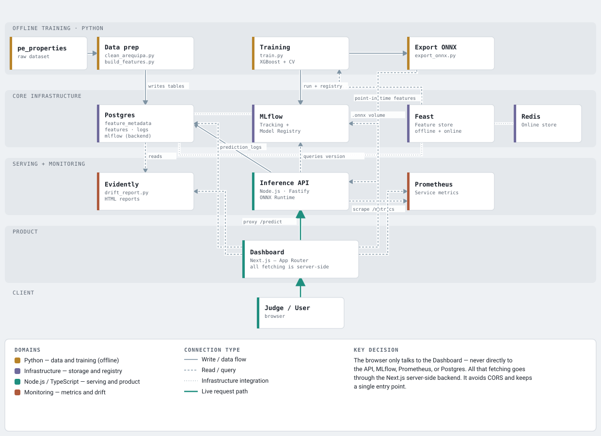

# Property Price Predictor — Arequipa

Predicts sale/rent prices for real estate listings in Arequipa, Peru, from property attributes (district, surface, type, operation). Built as an end-to-end MLOps pipeline: raw data to production model, with feature store, experiment tracking, inference API, monitoring, and dashboard. Model served via ONNX behind a Node.js/Fastify API.



In-depth documentation (Spanish): https://mlops-project.angeljsd.dev

## Stage 0 — Setup

Requires Python 3.

```bash
python3 -m venv .venv
source .venv/bin/activate
pip install -r ml/requirements.txt
```

## Stage 1 — Data: download and cleaning

Requires Kaggle API credentials (token at https://www.kaggle.com/settings -> API tokens):

```bash
export KAGGLE_API_TOKEN=xxxxxxxxxxxxxx
# or: kaggle auth login
# or: legacy kaggle.json at ~/.kaggle/kaggle.json
```

```bash
source .venv/bin/activate
./scripts/download_dataset.sh
```

Downloads `pe_properties.csv` to `data/raw/` (idempotent).

```bash
python3 ml/data_prep/clean_arequipa.py
```

Generates `data/processed/listings.parquet` (gitignored, regenerated by this command).

## Stage 2 — Features and metadata catalog

```bash
source .venv/bin/activate
python3 ml/data_prep/build_features.py
```

Reads `listings.parquet`, adds `district_avg_price_per_m2`, saves `data/processed/features.parquet`.

The metadata catalog lives in `ml/feature_metadata.csv` (tracked in git) until it's loaded into Postgres in Stage 4.

## Stage 3 — Baseline model

Requires XGBoost (on Mac: `brew install libomp` if the import fails).

```bash
source .venv/bin/activate
python3 ml/training/train.py
```

Trains and saves two XGBoost models (Sale/Rent) in `data/processed/models/` (gitignored). Prints R²/RMSE/MAE/MAPE for each.

## Stage 4 — Base infrastructure (Docker Compose)

Requires Docker and Docker Compose.

```bash
cp .env.example .env
docker compose up -d --build
docker compose ps   # all 7 services should be "healthy"
```

```bash
source .venv/bin/activate
python3 ml/data_prep/load_feature_metadata.py
```

Loads `ml/feature_metadata.csv` into the `feature_metadata` table (upsert by `name`, no duplicate rows on re-run).

Verify:

```bash
docker compose exec postgres psql -U aqp -d aqp_housing -c "SELECT * FROM feature_metadata;"   # 5 rows
docker compose exec redis redis-cli ping                                                         # PONG
curl http://localhost:5001/                                                                       # MLflow UI, HTTP 200
curl http://localhost:6566/health                                                                 # Feast feature server, HTTP 200
```

## Stage 5 — Feature store (Feast)

```bash
source .venv/bin/activate
python3 ml/data_prep/load_features_to_postgres.py
```

Fully replaces the `features` table in Postgres with the contents of `features.parquet` (`TRUNCATE` + insert).

```bash
docker compose exec feast feast -c /app/feature_repo materialize 2019-01-01T00:00:00 2020-04-01T00:00:00
```

Pushes values from the offline store (Postgres) to the online store (Redis).

Verify:

```bash
docker compose exec redis redis-cli DBSIZE   # 6811

curl -s -X POST http://localhost:6566/get-online-features \
  -H "Content-Type: application/json" \
  -d '{
    "features": ["arequipa_listings_features:district", "arequipa_listings_features:surface"],
    "entities": {"id": ["KJlhh3C7WTxl8gf76ZL82g=="]}
  }'
```

## Stage 6 — Final model (Feast + MLflow + ONNX)

Requires the Stage 4 stack, with data loaded and materialized (Stage 5).

```bash
source .venv/bin/activate
python3 ml/training/train.py
```

Reads features from the Feast offline store (not directly from `features.parquet` as in Stage 3). Tracks each run in MLflow (experiment `arequipa-housing-price`) and registers the model in the Model Registry (`arequipa-price-venta`, `arequipa-price-alquiler`). UI at `http://localhost:5001`.

```bash
python3 ml/training/export_onnx.py
```

Converts both models to ONNX and validates predictions against the original model (tolerance `1e-3`). Saves `data/processed/models/{venta,alquiler}_xgb.onnx`.

Verify:

```bash
curl -s http://localhost:5001/api/2.0/mlflow/registered-models/search   # arequipa-price-venta and arequipa-price-alquiler, status READY
```

## Stage 7 — Inference API (Node.js/Fastify)

Requires the models already trained and exported (Stage 6) — `data/processed/models/{venta,alquiler}_xgb.{json,onnx,categories.json}` must exist before starting this service.

```bash
docker compose up -d --build api
```

Test a prediction:

```bash
curl -s -X POST http://localhost:3000/predict \
  -H "Content-Type: application/json" \
  -d '{"district": "Cayma", "surface": 115, "property_type": "Departamento", "operation_type": "Venta"}'
```

Verify traceability:

```bash
docker compose exec postgres psql -U aqp -d aqp_housing -c "SELECT * FROM prediction_logs ORDER BY id DESC LIMIT 5;"
```

## Stage 8 — Monitoring (Prometheus + Evidently)

Requires the API running (Stage 7).

```bash
docker compose up -d --build prometheus
```

UI at `http://localhost:9090`.

```bash
curl -s "http://localhost:9090/api/v1/query?query=http_requests_total" | python3 -m json.tool
```

```bash
source .venv/bin/activate
python3 ml/monitoring/drift_report.py
```

Compares training features against `prediction_logs` (recent traffic). One HTML report per `operation_type` in `data/processed/drift_reports/` (gitignored).

## Stage 9 — Observability dashboard (Next.js)

Requires the full stack above, with traffic and reports generated (Stages 7/8).

```bash
docker compose up -d --build dashboard
```

UI at `http://localhost:3002`. Sections: Predictor, Models (MLflow), Monitoring (Prometheus), Drift (Evidently), Feature Catalog.

Test the predictor: open `http://localhost:3002/predictor` and fill out the form (e.g. district `Cayma`, surface `115`, type `Departamento`, operation `Venta`).

## Bring everything up at once

```bash
cp .env.example .env
docker compose up -d --build
source .venv/bin/activate
python3 ml/data_prep/load_feature_metadata.py
python3 ml/data_prep/load_features_to_postgres.py
docker compose exec feast feast -c /app/feature_repo materialize 2019-01-01T00:00:00 2020-04-01T00:00:00
python3 ml/training/train.py
python3 ml/training/export_onnx.py
docker compose up -d --build api prometheus dashboard
```

Dashboard: `http://localhost:3002` · MLflow: `http://localhost:5001` · Prometheus: `http://localhost:9090`.
